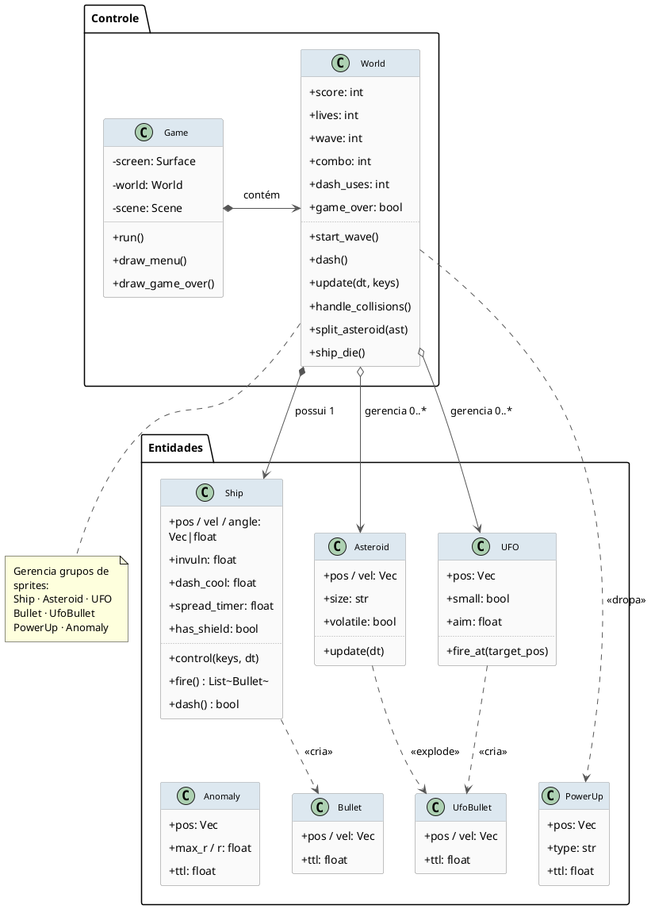

# Arquitetura C4 Model — Asteroids Atualizado (PlantUML)

Diagramas gerados conforme as regras oficiais de [c4model.com](https://c4model.com), usando a sintaxe PlantUML com as macros oficiais da biblioteca [C4-PlantUML](https://github.com/plantuml-stdlib/C4-PlantUML).

---

## Nível 1 — Diagrama de Contexto de Sistema

> **Propósito:** Mostra o jogo dentro do seu mundo. Quem usa e do que ele depende externamente.

```plantuml
@startuml C4_Nivel1_Contexto
!include https://raw.githubusercontent.com/plantuml-stdlib/C4-PlantUML/master/C4_Context.puml

SHOW_PERSON_OUTLINE()

Person(jogador, "Jogador", "Pessoa que controla a nave usando o teclado para destruir asteroides, escapar de buracos negros e acumular pontos.")

System(asteroids, "Asteroids Atualizado", "Jogo single-player estilo arcade. Combina a jogabilidade clássica de asteroides com 5 mecânicas novas: Dash econômico, Combos, Asteroides Vermelhos, Power-Ups e Buracos Negros.")

System_Ext(so, "Sistema Operacional", "Windows, macOS ou Linux. Gerencia a janela gráfica e captura os eventos físicos do teclado.")

System_Ext(python_runtime, "Python Runtime", "Ambiente de execução que interpreta e roda o código do jogo.")

Rel(jogador, asteroids, "Joga e interage com", "Teclado")
Rel(asteroids, so, "Solicita janela gráfica e lê eventos de input", "SDL2 via Pygame")
Rel(asteroids, python_runtime, "É interpretado e executado por")

@enduml
```

---

## Nível 2 — Diagrama de Container

> **Propósito:** Revela a decomposição interna do sistema em blocos executáveis e de configuração.

```plantuml
@startuml C4_Nivel2_Container
!include https://raw.githubusercontent.com/plantuml-stdlib/C4-PlantUML/master/C4_Container.puml

SHOW_PERSON_OUTLINE()

Person(jogador, "Jogador", "Controla a nave e interage com o jogo via teclado.")

System_Boundary(asteroids_sys, "Asteroids Atualizado") {

    Container(app, "Aplicação do Jogo", "Python 3.12 + Pygame 2.6", "Processo principal do jogo. Executa o game loop a 60 FPS, gerencia todas as entidades (nave, asteroides, UFOs, power-ups, buracos negros) e as 5 novas mecânicas de gameplay. Ponto de entrada: src/main.py.")

    Container(config_module, "Módulo de Configuração", "Python Module (config.py)", "Repositório imutável de constantes de balanceamento: velocidades, raios de colisão, cooldown do Dash, custo por uso, força gravitacional dos buracos negros, chance de drop de power-ups e durações de timers.")
}

System_Ext(so, "Sistema Operacional", "Fornece a janela de renderização e os eventos de teclado via SDL2.")

Rel(jogador, app, "Pressiona teclas para controlar a nave", "Eventos de teclado SDL2")
Rel(app, config_module, "Lê constantes de balanceamento em tempo de execução", "Python import")
Rel(app, so, "Solicita renderização de frames e captura input", "Pygame / SDL2")

@enduml
```

---

## Nível 3 — Diagrama de Componentes

> **Propósito:** Dá zoom na Aplicação do Jogo e expõe seus blocos internos de responsabilidade.

```plantuml
@startuml C4_Nivel3_Componentes
!include https://raw.githubusercontent.com/plantuml-stdlib/C4-PlantUML/master/C4_Component.puml

' Forçar layout em grade controlada por direções explícitas
top to bottom direction
skinparam wrapWidth 180

SHOW_PERSON_OUTLINE()

Person(jogador, "Jogador")

Container_Boundary(app, "Aplicação do Jogo (Python + Pygame)") {

    ' --- Linha 1: Entrada e Orquestração Inicial ---
    together {
        Component(input_handler, "Captura de Input", "game.py", "Lê o teclado a cada frame (setas, espaço, Shift) e delega as ações.")
        Component(game_loop,     "Game Loop / Cenas", "game.py", "Ciclo a 60 FPS. Alterna entre Menu, Play e Game Over.")
    }

    ' --- Linha 2: Núcleo da Simulação ---
    Component(world_system, "Sistema de Mundo", "systems.py – World", "Coordena ondas, spawn de inimigos, colisões e pontuação geral.")

    ' --- Linha 3: Lógica Especializada ---
    together {
        Component(mechanics_engine, "Motor das Novas Mecânicas", "systems.py + sprites.py", "Dash, Combo, Power-Ups, Buracos Negros e Asteroides Vermelhos.")
        Component(sprites_engine,   "Motor de Entidades", "sprites.py", "Comportamento de Ship, Asteroid, UFO, Bullet, PowerUp e Anomaly.")
    }

    ' --- Linha 4: Saída e Configuração ---
    together {
        Component(renderer,      "Renderizador e HUD", "systems.py + game.py", "Desenha todos os sprites e exibe o HUD com Score, Dash e Combo.")
        Component(config_reader, "Configurações", "config.py", "Constantes de balanceamento: velocidades, cooldowns, custos e forças.")
    }
}

' Fluxo de entrada → orquestração (linha horizontal)
Rel_R(jogador,       input_handler, "Pressiona teclas")
Rel_R(input_handler, game_loop,     "Envia ação mapeada")

' Orquestração → núcleo (desce)
Rel_D(game_loop, world_system, "update(dt) / draw()")

' Núcleo → lógica especializada (desce, lado a lado)
Rel_D(world_system, mechanics_engine, "Delega mecânicas")
Rel_D(world_system, sprites_engine,   "Atualiza grupos de sprites")

' Lógica especializada → saída (desce)
Rel_D(mechanics_engine, renderer, "Estados calculados")
Rel_D(sprites_engine,   renderer, "Posição e forma")

' Leituras de configuração (da direita para o nó config)
Rel_R(world_system,     config_reader, "Lê constantes")
Rel_R(mechanics_engine, config_reader, "Lê custos e limites")
Rel_U(config_reader,    renderer,      "Lê cores e dimensões")

@enduml
```

---

## Nível 4 — Diagrama de Classes (UML)

> **Propósito:** Detalha as classes reais do código com atributos, métodos e relacionamentos.
> *Nota: As macros C4-PlantUML não cobrem o Nível 4. Usamos o `classDiagram` nativo do PlantUML conforme recomendado pelo c4model.com.*




